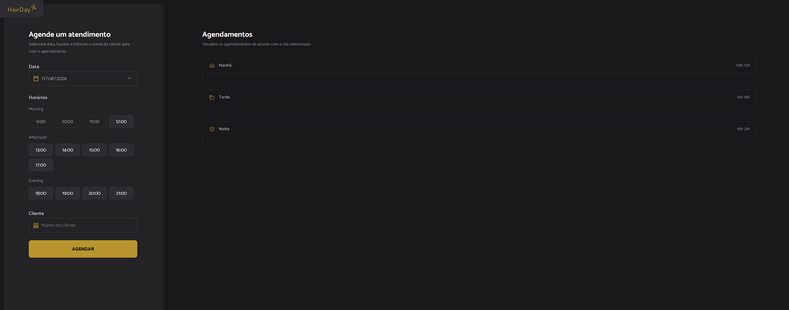

# HairDay

Sistema de agendamento de horários para salão de cabelo, com build via Webpack.

## Preview

<p align="center">
  
</p>

## Sobre o projeto

O usuário escolhe uma data, seleciona um horário disponível (manhã, tarde ou noite) e informa o nome do cliente pra criar o agendamento. Do lado direito fica a lista de agendamentos já feitos, organizada por período do dia (Manhã, Tarde, Noite), de acordo com a data selecionada. Os agendamentos são salvos numa API local simulada com JSON Server.

## Tecnologias

- HTML
- CSS
- JavaScript
- Webpack + Babel
- JSON Server (API mock, salva os agendamentos em `server.json`)
- Day.js (manipulação de datas)

## Funcionalidades

- Seleção de data para agendamento
- Seleção de horário dividido em manhã, tarde e noite
- Cadastro do nome do cliente no agendamento
- Listagem dos agendamentos por período do dia, filtrados pela data

## Estrutura do projeto

```
index.html
src/
dist/
package.json
webpack.config.js
server.json
```

## Como executar

git clone https://github.com/theusan777/hairday.git
npm install

O projeto precisa de dois processos rodando ao mesmo tempo, em terminais separados:

npm run server

Sobe a API mock (json-server) na porta 3333, lendo os dados do `server.json`.

npm run dev

Sobe o front-end com webpack-dev-server.

## Aprendizados

Foi o primeiro projeto grande que fiz, envolvendo mais organização de código (pastas `src`/`dist`) e configuração de build com Webpack, em vez de só abrir o HTML direto no navegador.
